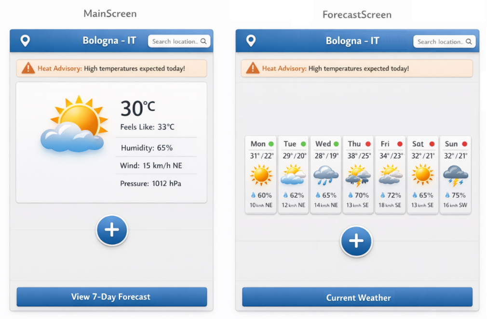

# User Guide

This is a **mockup** showing the general idea of what the main screen and forecast screen would look like to a user:

UI mockup

## First launch and geolocation permission

On first launch the app will ask the user for geolocation permission, a pop-up will provide 2 options:

- Allow -  the app automatically detects the user's location and displays the main screen with appropriate primary weather indicators.

- Deny - the app does not display indicators until a location is chosen using the location search bar, if the user wishes to allow geolocation later they can press the location pin icon in the upper-left corner.

## Viewing current weather

The main screen displays the location name on top and current primary indicator values for that location.

The primary indicators displayed on the main screen include:

- Temperature

- Humidity

- Wind speed and direction

- Cloud formation

- Atmospheric events

Indicators update automatically when the app launches or a new location is selected.

## Screen switching

The main screen should appear once the app is launched, the forecast screen can be reached by pressing the **“View 7-Day Forecast” button** at the bottom. 

The **“Current Weather” button** can then be used to return to the main screen.

## Viewing the forecast

The forecast screen displays the forecast for 7 upcoming days.

Each day shows a colored dot representing forecast accuracy:

- Green → high accuracy (within 72 hours)

- Red → lower accuracy (beyond 72 hours)

This description can be viewed anytime by clicking on the colored accuracy indicators.

## Location search

To select a location:

1. Click on the search bar in the top-right corner

2. Enter the location of interest (city/town/region) or choose one of the suggested previously searched locations

The searched location will be used to update the current indicators and forecast and stored locally for future use.

## Secondary indicators

By default, secondary indicators (e.g., air quality, pollen alerts) are hidden.

To enable them:

1. Click the “+” icon on the main screen.

2. Select one or more indicators from the pop-up menu.

The selected indicators will now appear on the main screen.

Indicators can be disabled at any time using the same menu.

## Alerts

Extreme events (heat wave, flood, thunderstorm, volcanic eruptions etc.) appear as an alert icon on the main screen.

Clicking the alert redirects to the official website of the issuing authority for more information.

## Troubleshooting

If no weather data is shown:

- Check internet connection

- If geolocation is denied, ensure a location is selected manually using the search bar
